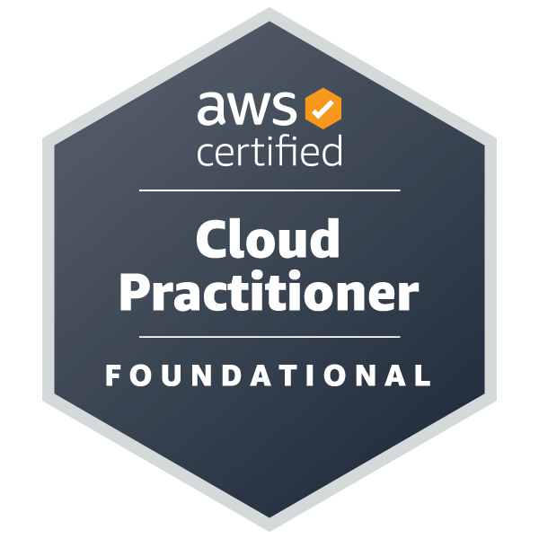
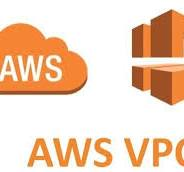

👋 Hi, I'm Moses Njuguna—a dedicated professional with a deep passion for Cybersecurity and Cloud Solutions. With hands-on experience in securing, managing, and optimizing IT infrastructures, I'm always eager to tackle new challenges and expand my tech expertise. I'm detail-oriented, enthusiastic about continuous learning, and committed to delivering high-quality results. A collaborative team player, I thrive in cooperative environments and am always looking for ways to enhance my skills and knowledge. Let’s connect and build something impactful together!

# Interests

The Particular fields of tech I'm interested in are as follows

## 1. CyberSecurity 

Here's a rephrased version:

What first sparked my interest in tech was stumbling across YouTube videos of security professionals doing fascinating things with the browser and the Kali Linux command line. I didn’t fully understand what they were doing at the time, but I knew I wanted to learn and be able to do the same. 

 

### These are my acheivements so far:

   &nbsp; 
 

 

### My Prefered Learning PLatforms

 &nbsp; 
`Kali Linux` - The most prefered pentesting linux distro

 &nbsp; 
`Parrot OS` - My prefered pentesting linux distro

 &nbsp; 
`Hack The Box` - A platform full of machines to attack and learn from as well as competitions

 &nbsp; 
`PortSwigger` - A platform for learning and practicing web security

 &nbsp; 
`TryHackMe` - A platform for learning and practicing security concepts

 &nbsp; 
`Pico CTF` - A platform full of CTF challenges from beginner to advanced

 &nbsp;
`Cisco` - A learning platform to learn networking, linux, cybersecurity and more

[Try hack Me](https://tryhackme.com/) and [Hack The Box](https://www.hackthebox.com/) have really taught me alot and the best part is, I'm not done learning.

### Tools That I am very comfortable using

 &nbsp; `Wireshark` - For network analysis and troubleshooting

 &nbsp; `Nmap` - For recon

 &nbsp; `Burpsuite` - For learning web security

 &nbsp; `volatility` - a tool for memory forensics.

## 2. Networking

My interest in networking started as soon as I learned about basic web protocols. From there, I chose to dive deeper into networking with Cisco, studied a CCNA course, and earned an introduction to Networks badge.

 

## 3. Cloud Technologies 
My interest in cloud technologies led me to enroll in the AWS re/Start program from May to August 2024, where I became an AWS Certified Cloud Practitioner and earned an AWS re/Start badge. I'm excited to continue expanding my knowledge in cloud computing and take my skills to the next level!

 

## I am familiar with the following AWS tools just to highlight a few.

 &nbsp; `AmazonVPC`  
Amazon VPC lets you create a private, isolated network within AWS, giving you control over IP addresses, subnets, and security settings to securely deploy resources.

 &nbsp; `AmazonCloudFront`  
Amazon CloudFront is a global content delivery network (CDN) that securely delivers data, videos, applications, and APIs with low latency and high transfer speeds.

 &nbsp; `AmazonCloudFormation`  
Amazon CloudFormation automates the setup and deployment of AWS resources using templates, allowing you to model and manage your infrastructure as code.

 &nbsp; `AmazonEC2`  
Amazon EC2 provides scalable virtual servers in the cloud, allowing you to quickly launch, configure, and manage compute resources for various applications.

 

## 4. Programming Languages

 &nbsp; `Python` - For scripting

### My Tools

 &nbsp; `VS Code` - Because it is lightweight, easy to use and has a wealth of extensions that improve the developer experience.
